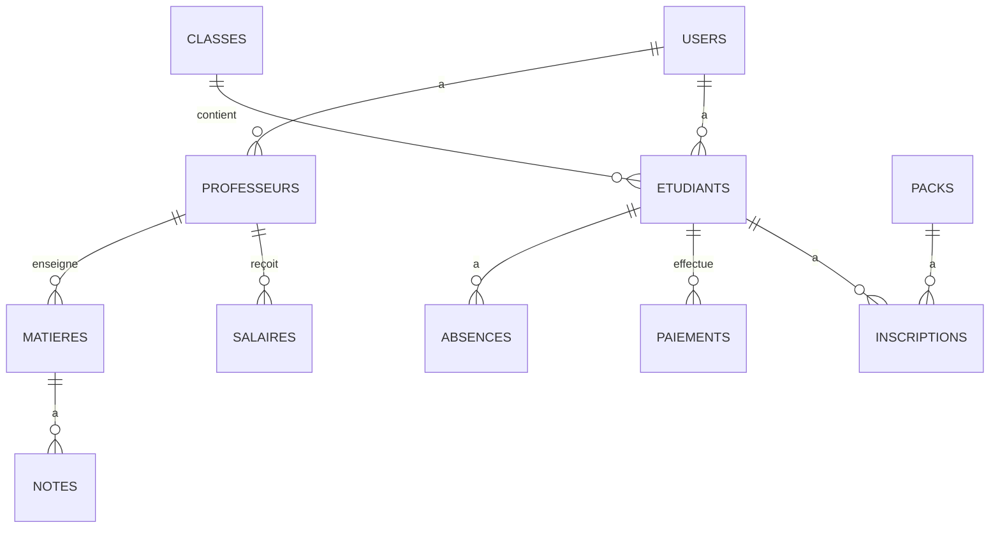

# Architecture Technique - Allo Tawjih

Ce document fournit une vue d'ensemble de l'architecture technique de l'application Allo Tawjih, conçue pour être évolutive, maintenable et sécurisée.

## 🏗️ Architecture Globale

L'application suit une architecture MVC (Modèle-Vue-Contrôleur) avec une séparation claire des préoccupations :

```
app/
├── Console/          # Commandes Artisan personnalisées
├── Events/           # Événements
├── Exceptions/       # Gestionnaires d'exceptions
├── Http/             # Contrôleurs, Middleware, Requêtes
│   ├── Controllers/  # Logique métier
│   ├── Middleware/   # Couche intermédiaire
│   └── Requests/     # Validation des requêtes
├── Jobs/             # Tâches en file d'attente
├── Listeners/        # Écouteurs d'événements
├── Mail/             # Modèles d'emails
├── Models/           # Modèles Eloquent
├── Notifications/    # Notifications
├── Policies/         # Autorisations
├── Providers/        # Fournisseurs de services
└── Services/         # Couche de service
```

## 🔄 Flux de Données

1. **Couche Présentation (Vue.js)**
   - Composants réutilisables
   - Gestion d'état avec Pinia
   - Validation côté client avec Vee-Validate
   - Internationalisation avec vue-i18n

2. **Couche API (Laravel)**
   - Routes API RESTful
   - Authentification via Sanctum
   - Validation des requêtes
   - Transformation des données avec les Resources

3. **Couche Métier**
   - Services métier pour la logique complexe
   - Événements et écouteurs pour une logique découplée
   - Jobs pour les tâches asynchrones

4. **Couche Données**
   - Modèles Eloquent avec relations
   - Scopes pour les requêtes courantes
   - Observateurs pour la logique liée aux modèles

## 🔐 Sécurité

### Authentification
- Authentification multi-guards (admin, professeur, étudiant)
- Jetons d'API avec expiration
- Protection CSRF
- Limitation des tentatives de connexion

### Autorisation
- Politiques (Policies) pour chaque ressource
- Rôles et permissions avec Spatie Permission
- Vérification des autorisations dans les contrôleurs et vues

### Protection des Données
- Chiffrement des données sensibles
- Masquage des données dans les logs
- Protection contre les attaques XSS et SQL Injection

## 🚀 Performance

### Mise en Cache
- Cache des requêtes fréquentes
- Cache des vues et des routes
- Mise en cache des résultats coûteux

### Optimisation des Requêtes
- Chargement optimisé des relations (Eager Loading)
- Indexation des colonnes fréquemment interrogées
- Pagination des résultats

### Optimisation Frontend
- Compilation des assets (Vite)
- Chargement différé des images
- Minification du CSS/JS

## 🔄 Intégrations

### Services Externes
- Envoi d'emails (SMTP/Mailgun)
- Paiements en ligne (Stripe/CMI)
- Stockage cloud (S3/Spaces)

### API Tierces
- Google Workspace pour l'authentification
- Microsoft Graph pour l'intégration Office 365
- Services SMS pour les notifications

## 📊 Base de Données

### Schéma Principal


### Migrations
Les migrations sont utilisées pour gérer l'évolution du schéma de base de données de manière versionnée.

## 🧪 Tests

### Tests Unitaires
- Tests des modèles et services
- Tests des règles de validation
- Tests des composants isolés

### Tests d'Intégration
- Tests des contrôleurs
- Tests des routes API
- Tests des middlewares

### Tests E2E
- Tests du parcours utilisateur complet
- Tests d'interface avec Dusk
- Tests de régression

## 🔄 CI/CD

### Intégration Continue
- Exécution automatique des tests
- Analyse statique du code
- Vérification des vulnérabilités

### Déploiement Continu
- Déploiement automatique sur staging
- Déploiement manuel en production
- Rollback automatique en cas d'échec

## 📚 Documentation

### Génération de Documentation
- Documentation API avec Scribe
- Documentation technique avec PHPDoc
- Guides utilisateur

### Standards de Code
- PSR-12 pour le PHP
- ESLint/Prettier pour le JavaScript
- Conventions de nommage cohérentes

## 🔧 Maintenance

### Journalisation
- Logs détaillés des actions utilisateur
- Surveillance des erreurs (Sentry)
- Alertes en temps réel

### Sauvegarde
- Sauvegardes automatiques de la base de données
- Rétention des sauvegardes
- Tests de restauration réguliers

## 📱 Support Mobile

### Application Mobile (Future Version)
- API dédiée pour mobile
- Notifications push
- Synchronisation hors ligne

### PWA
- Installation sur l'écran d'accueil
- Mode hors ligne
- Notifications push

---

*Dernière mise à jour : Août 2023*
